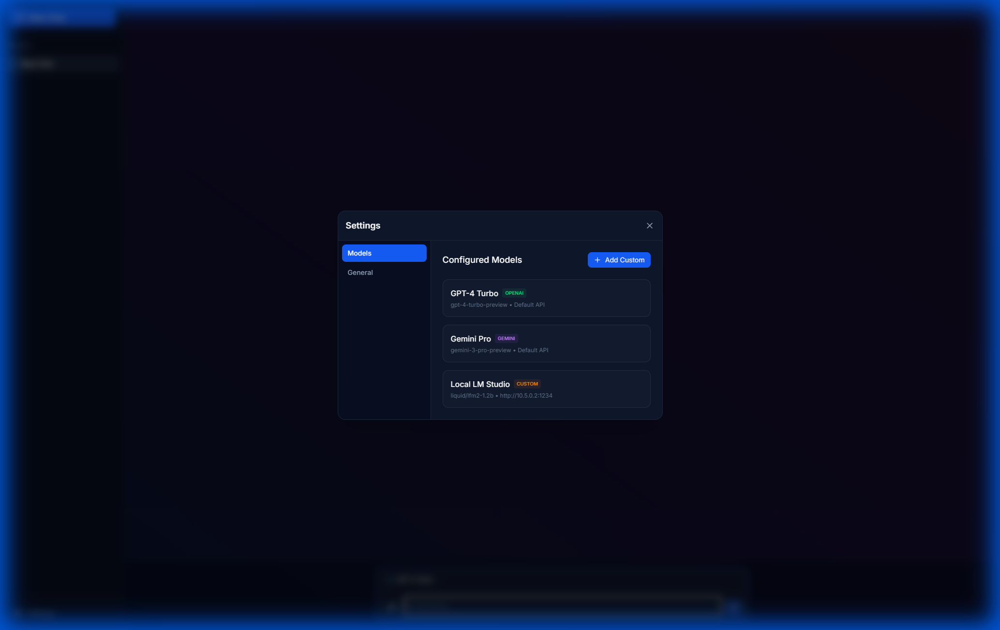
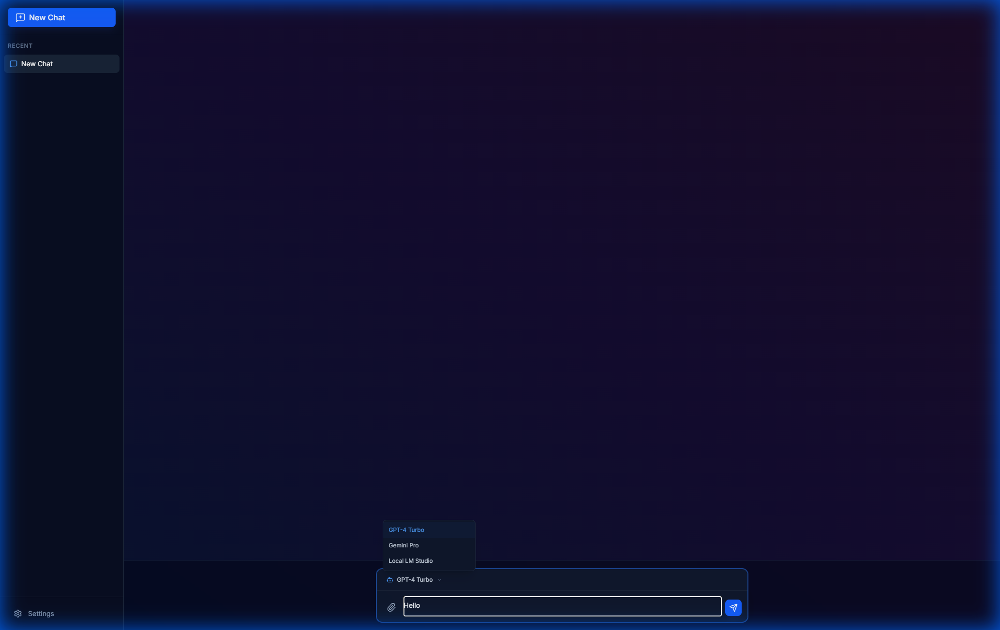

# Multi-Model Chat Application

A modern, feature-rich web chat application that allows you to interact with multiple AI models including OpenAI's GPT-4, Google's Gemini, and local LLMs (via LM Studio/Ollama) through a unified, sleek interface.


## Features

-   **Multi-Model Support**: Seamlessly switch between OpenAI, Gemini, and Custom (Local) models.
-   **Real-time Streaming**: Experience typewriter-style responses with streaming support for OpenAI and compatible providers.
-   **Rich UI/UX**: Modern dark-themed interface with glassmorphism effects, smooth animations, and responsive design.
-   **Image Attachments**: Upload and send images to supported multimodal models.
-   **Model Discovery**: Automatically discover available models from your connected providers.
-   **Persistent Chat History**: Your conversations are saved locally, allowing you to revisit them anytime.
-   **Markdown Support**: AI responses are rendered with full Markdown support, including code highlighting.

## Quick Start

### 1. Configure Your Models
Click the **Settings** (gear icon) in the sidebar to open the configuration modal.



-   **OpenAI**: Enter your API Key.
-   **Gemini**: Enter your Google AI API Key.
-   **Custom**: Enter your local server URL (e.g., `http://localhost:1234/v1` for LM Studio).

Use the **Discover** button to automatically fetch and select available models from your provider.

### 2. Chatting
Type your message in the prompt bar at the bottom. You can select the active model from the dropdown menu above the input field.



-   **Attach Images**: Click the paperclip icon to upload images.
-   **Send**: Press Enter or click the send button.

## Technologies

-   **Frontend Framework**: [React](https://react.dev/) with [Vite](https://vitejs.dev/)
-   **Language**: [TypeScript](https://www.typescriptlang.org/)
-   **Styling**: [Tailwind CSS](https://tailwindcss.com/)
-   **State Management**: [Zustand](https://github.com/pmndrs/zustand) (with persistence)
-   **Icons**: [Lucide React](https://lucide.dev/)
-   **Markdown Rendering**: `react-markdown`

## Architecture

The application follows a client-side architecture, communicating directly with AI providers.

```mermaid
graph TD
    User[User] --> UI[React UI]
    UI --> Store[Zustand Store]
    UI --> API[API Service]
    
    subgraph "State Management"
        Store --> LocalStorage[Local Storage]
    end
    
    subgraph "External Providers"
        API --> OpenAI[OpenAI API]
        API --> Gemini[Google Gemini API]
        API --> Local[Local LLM (LM Studio/Ollama)]
    end
    
    API -.->|Streamed Response| UI
```

## How to Build and Run

### Prerequisites
-   Node.js (v16 or higher)
-   npm or yarn

### Installation

1.  Clone the repository:
    ```bash
    git clone https://github.com/phobosd/Multi-Model-Chat.git
    cd Multi-Model-Chat
    ```

2.  Install dependencies:
    ```bash
    npm install
    ```

3.  Start the development server:
    ```bash
    npm run dev
    ```
    The app will be available at `http://localhost:5173`.

### Building for Production

To create a production build:

```bash
npm run build
```

The build artifacts will be stored in the `dist/` directory.

## License

MIT
